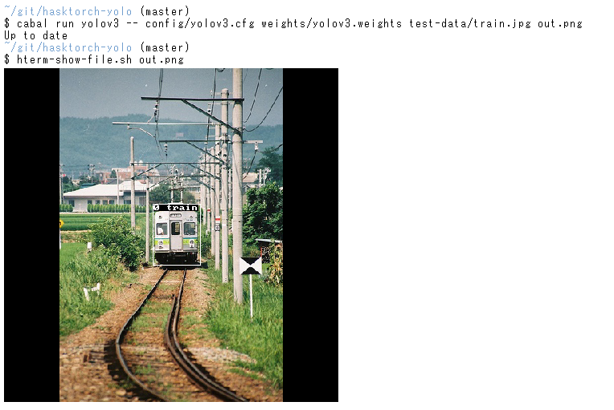

# Hasktorch Yolo

This repository develops yolov3 using hasktorch.
It is based on https://github.com/eriklindernoren/PyTorch-YOLOv3.

It supports the format of the original yolo config and weight files.
See [this link](https://pjreddie.com/darknet/yolo/) for original yolo.

For now, we use pre-trained weights.
We do not support testing and training, yet.

The sources of the config and weight file are following links.
These are already included in this repository.

```
https://raw.githubusercontent.com/eriklindernoren/PyTorch-YOLOv3/master/config/yolov3.cfg
https://pjreddie.com/media/files/yolov3.weights

```

# Getting Started

### linux+cabal

```shell
git lfs clone git@github.com:junjihashimoto/hasktorch-yolo.git
cabal test all
```

### linux+nix

```shell
git lfs clone git@github.com:junjihashimoto/hasktorch-yolo.git
nix-build
```

# Inference

Use the following command for inference.
An image with a bounding box is output.
The execution example is fig.1.

### linux+cabal

```shell
cabal run yolov3 -- config/yolov3.cfg weights/yolov3.weights test-data/train.jpg out.png
```

### linux+nix

```shell
nix-build
./result-2/bin/yolov3 config/yolov3.cfg weights/yolov3.weights test-data/train.jpg out.png
```




